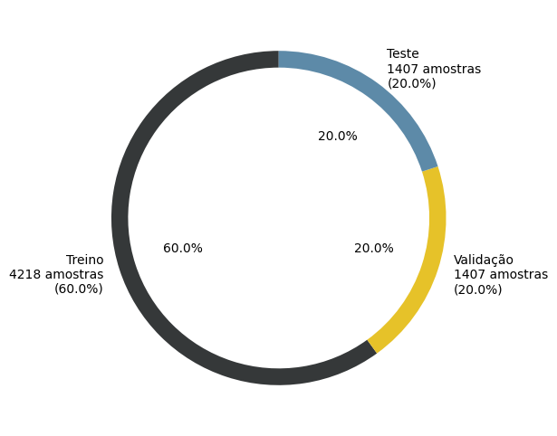
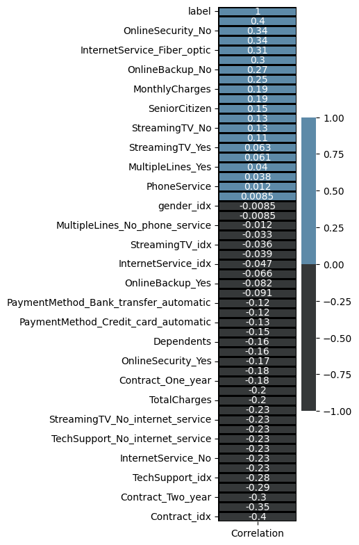

# 📞 Projeto de Previsão de Churn - Telco Customer Churn

**Objetivo**: Prever a rotatividade de clientes (churn) em uma empresa de telecomunicações usando XGBoost com dados processados no Databricks.

---

## 🛠️ Fluxo de Dados (Databricks)
| Camada       | Processamento                          |
|--------------|----------------------------------------|
| **Bronze**   | Dados brutos ingeridos da fonte        |
| **Silver**   | Tratamento de valores nulos/missing    |
| **Gold**     | Pré-processamento para ML:             |
|              | - Label Encoding & Binary Encoding     |
|              | - One-Hot Encoding                     |

---

## 🔍 Análise e Seleção de Features
- **Correlação com Target**: Seleção inicial baseada em correlação

- **Teste Qui-Quadrado**: Filtro estatístico (features com score <20 removidas, `qui2.png`)
  

---

## ⚙️ Modelagem
### Pipeline de Pré-processamento

