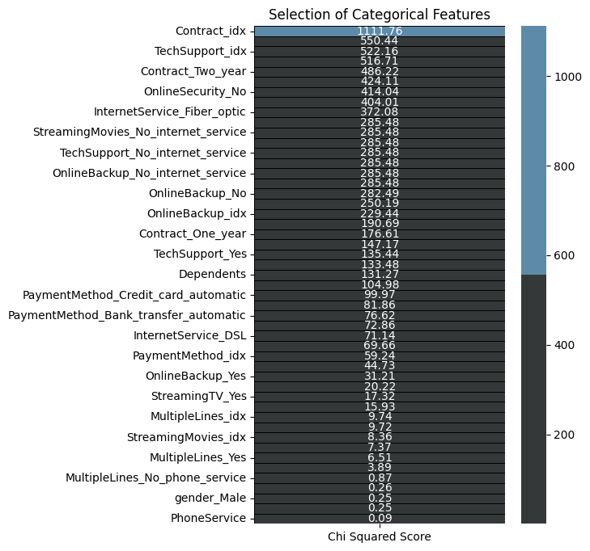
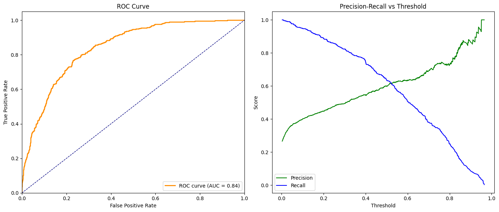
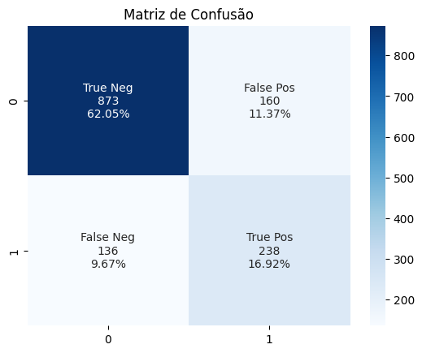

# 📞 Projeto de Previsão de Churn - Telco Customer Churn

**Objetivo**: Prever a rotatividade de clientes (churn) em uma empresa de telecomunicações usando XGBoost com dados processados no Databricks.

---

## 🛠️ Fluxo de Dados (Databricks)
| Camada       | Processamento                          |
|--------------|----------------------------------------|
| **Bronze**   | Dados brutos ingeridos da fonte        |
| **Silver**   | Tratamento de valores nulos/missing    |
| **Gold**     | Pré-processamento para ML:             |
|              | - Label Encoding & Binary Encoding     |
|              | - One-Hot Encoding                     |

---

## 🔍 Análise e Seleção de Features
- **Correlação com Target**: Identificação das variáveis numéricas mais relacionadas ao churn 

- **Teste Qui-Quadrado**: Filtragem estatística para selecionar apenas features com maior significância (p-valor > 20)

---

## ⚙️ Modelagem e  Pré-processamento
### Pré-processamento
  - Normalização das variáveis numéricas (escala 0-1)
  - Balanceamento do dataset com SMOTE (aplicado apenas nos dados de treino)

### Busca de Hiperparametros
Para maximizar o desempenho do modelo XGBoost, foi realizada uma busca sistemática de hiperparâmetros utilizando a biblioteca Optuna. O processo seguiu uma abordagem científica, explorando combinações inteligentes de parâmetros para encontrar a configuração ideal que minimiza o erro (RMSE) no conjunto de validação. O resultados foram:

| Hiperparâmetro       | Valor   |
|----------------------|---------|
| learning_rate        | 0.021   |
| max_depth           | 7       |
| subsample           | 0.812   |
| colsample_bytree    | 0.144   |
| min_child_weight    | 1       |

## 📈 Resultados

## 📊 Classification Report (XGBoost)

| Classe | Precision | Recall | F1-Score | Support |
|--------|-----------|--------|----------|---------|
| **Não Churn**  | 0.90      | 0.76   | 0.82     | 1033    |
| **Churn**  | 0.54      | 0.78   | 0.64     | 374     |

| Métrica         | Precision | Recall | F1-Score | Support |
|-----------------|-----------|--------|----------|---------|
| **Accuracy**    | -         | -      | 0.76     | 1407    |
| **Macro Avg**   | 0.72      | 0.77   | 0.73     | 1407    |
| **Weighted Avg**| 0.81      | 0.76   | 0.77     | 1407    |

O modelo apresenta alta precisão (90%) para a classe majoritária (Não-Churn), enquanto para a classe Churn priorizamos recall (78%) para capturar mais casos reais, ainda que com precision moderada (54%). A acurácia global de 76% reflete o desafio do desbalanceamento.

A área sob a curva ROC (AUC = 0.84) confirma uma boa capacidade discriminativa do modelo. No entanto, a análise da curva Precision-Recall evidencia um dilema crítico:

  Para aumentar o recall (capturar mais churns reais), a precisão cai rapidamente, gerando mais falsos positivos.

  Se priorizarmos a precisão (reduzir falsos positivos), deixamos de identificar churns reais.

    Métricas de Otimização: Foco em maximizar AUC-PR (Precision-Recall) devido 