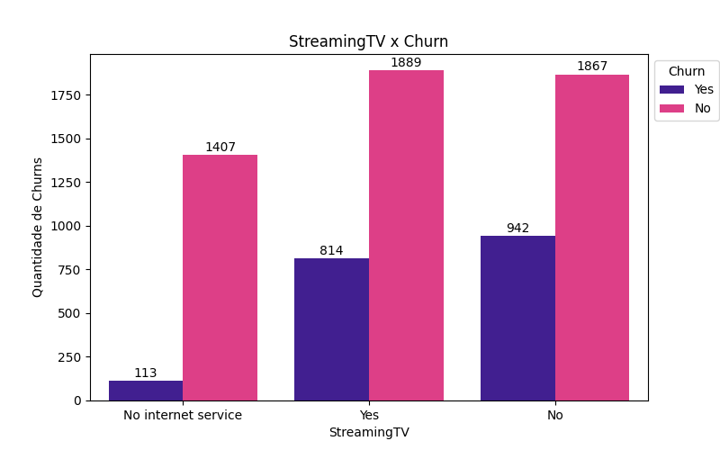

# Análise Exploratória de Dados (EDA) - Telecom Churn

## 1. Introdução
The Telco customer churn data contains information about a fictional telco company that provided home phone and Internet services to 7043 customers in California in Q3. It indicates which customers have left, stayed, or signed up for their services.

---

## 2. Dados Utilizados

*(Você pode complementar com as informações da base e variáveis aqui.)*

---

## 3. Análises Univariadas

### 3.1 - Distribuição do Churn

Aproximadamente 26.6% dos clientes cancelaram o serviço.  
Aqui apresenta-se um desbalanceamento na quantidade da amostra de usuários. A quantidade de cancelamentos é bem menor que a quantidade de não cancelamentos.

---

### 3.2 - Distribuição de Tempo de Contrato (Tenure)

Analisando a frequência dos valores de tempo de contrato, a figura sugere uma distribuição bimodal. Os maiores números de tempo de contrato concentram-se nos primeiros e nos últimos 6 meses deste recorte de tempo da base de dados.

No entanto, observa-se que os clientes com menos tempo de contrato são a maioria. Precisamos investigar se esses clientes também representam um maior número de cancelamentos (Churn).

De fato, mais de 50% dos clientes que possuem tempo de contrato de 0 a 6 meses cancelaram o serviço. Isso destaca que um menor tempo de contrato é um elemento importantíssimo para construir um perfil de risco.

---

### 3.3 - Distribuição de Cobrança Total (TotalCharges)

A distribuição é assimétrica, concentrada em clientes com baixas cobranças acumuladas.

Segmentando o total gasto pelo cliente (TotalCharges) em 4 intervalos, observamos que o maior número de cancelamento de serviço ocorre na faixa de menor valor de até $1000. O que é perfeitamente compreensível, uma vez que clientes com menos tempo de contrato tendem a cancelar o serviço e o montante arrecadado pela empresa tende a ser menor.

---

### 3.4 - Distribuição de Cobrança Mensal (MonthlyCharges)

Muitos clientes pagam tarifas mensais moderadas, mas existem planos com tarifas mais elevadas.

Apesar dos clientes da faixa de gastos totais até $1000 serem maioria na base de dados analisada, eles possuem as menores médias de tempo de contrato e de pagamento mensal, cerca de 10.1 meses e $48/mês, respectivamente. 

Ao contrário dos clientes da faixa $4000+, que possuem as maiores médias de tempo de contrato e de pagamento mensal. Além disso, aproximadamente 85% desses clientes não cancelaram o serviço.

---

## Grupo 1 - Churn vs (Gender | SeniorCitizen | Partner | Dependents)

### 1.1 - Churn vs Gênero

Há um balanceamento na amostra de clientes do sexo feminino e masculino.

---

### 1.2 - Churn vs Idosos (SeniorCitizen)

Temos um número muito pequeno de clientes idosos, cerca de 1142. No entanto, cerca de 41% deles cancelaram o serviço com a empresa, o que é uma porcentagem significativa diante do número total desse público.

---

### 1.3 - Churn vs Parceiros (Partner)

Clientes que possuem parceiros(as) têm menos cancelamentos em comparação com aqueles que vivem sozinhos.

---

### 1.4 - Churn vs Dependentes

Semelhante ao caso dos parceiros, os casos de cancelamento são maiores para aqueles clientes que não têm dependentes.

---

## Grupo 2 - Churn vs (PhoneService | MultipleLines | InternetService | StreamingTV | StreamingMovies)

### 2.1 - Churn vs Serviço de telefonia (PhoneService)

Um número expressivo de clientes, 90% (6352 clientes), possui serviço de telefonia. Destes clientes, 36.5% cancelaram o serviço por algum motivo.

---

### 2.2 - Churn vs Multiplas Linhas (MultipleLines)

Cerca de 42.2% (2667) dos clientes possuem múltiplas linhas disponíveis em suas residências. É interessante notar que ter ou não múltiplas linhas apresenta um número muito semelhante de cancelamento, o que sugere que isto pode não ser um fator determinante para o rompimento de contrato.

---

### 2.3 - Churn vs Serviços de internet (InternetService)

Entre os 3096 clientes que assinam o serviço de internet por fibra óptica, observamos um elevado número de cancelamentos, cerca de 40% (1297 clientes).

---

### 2.4 - Churn vs Streaming de TV

O serviço de streaming de TV por assinatura apresenta proporção equivalente de cancelamento entre aqueles que possuem e não possuem o serviço adicional no seu plano, cerca de 30% a 33% de taxa de cancelamento, respectivamente.

---

### 2.5 - Churn vs Streaming de Filmes

O comportamento é semelhante para aqueles que adicionaram serviço de filmes no plano: entre 30% a 34% de taxa de cancelamento, respectivamente, para quem possui e quem não possui o serviço.

---

## Grupo 3 - Churn vs (OnlineSecurity | OnlineBackup | DeviceProtection | TechSupport)

### 3.1 - Churn vs Serviço de Segurança Online (OnlineSecurity)

Clientes que não possuem pacote de segurança online, como VPN e gerenciador de senhas, têm um número considerável de cancelamentos em comparação com os clientes que possuem o serviço.  
Oferecer diferentes pacotes de proteção na web pode ser uma forma de mitigar o churn.

---

### 3.2 - Churn vs Serviço de Backup (OnlineBackup)

Semelhante ao caso anterior, o número de churn mais que dobra (de 523 para 1233) nos casos de clientes que não possuem serviço de backup de proteção de dados.

---

### 3.3 - Churn vs Serviço de Proteção para Dispositivos (DeviceProtection)

Mais uma vez, podemos observar o dobro de casos de cancelamento entre clientes que não possuem proteção adicional em relação aos que possuem este serviço no pacote.

---

### 3.4 - Churn vs Suporte Técnico (TechSupport)

Entre os clientes que não possuem suporte técnico adequado, há um crescimento expressivo no número de churn: de 310 para 1446, resultando em um aumento de 366.45% nos casos de cancelamento.

---

## Grupo 4 - Churn vs (Contract | PaperlessBilling | PaymentMethod)

### 4.1 - Churn vs Método de Pagamento

Majoritariamente, os clientes que optam pelo método de pagamento com cheque eletrônico apresentam a maior taxa de cancelamento (57.3%), contrastando com o débito automático no cartão de crédito (12.4%).  
Os métodos automáticos representam maior fidelização do cliente e, consequentemente, maior tempo de contrato e menor taxa de cancelamento.

---

### 4.2 - Churn por Tipo de Contrato

Como visto anteriormente por meio de diferentes análises, o churn é significativamente maior entre clientes com pouco tempo de contrato.

---

## 5 - Perfis de Risco

A partir da análise exploratória realizada, foi possível identificar diferentes segmentos de clientes com níveis distintos de risco de cancelamento. Estes perfis foram construídos com base nas variáveis mais impactantes sobre o churn, como tempo de contrato, forma de pagamento, serviços adicionais e características demográficas.

### 🔴 Perfil 1: Altíssimo Risco de Churn
- **Contrato:** Mensal
- **Forma de Pagamento:** Cheque Eletrônico
- **Tempo de Contrato:** Inferior a 6 meses
- **Serviços Adicionais:** Sem serviços de segurança online, backup ou suporte técnico
- **Cobrança Total:** Inferior a $1000
- **Descrição:**
  Clientes recém-adquiridos, com pouca fidelização e baixa percepção de valor agregado. Estes clientes utilizam métodos de pagamento mais voláteis e não possuem vínculo com serviços adicionais, o que os torna altamente suscetíveis ao churn.

---

### 🟠 Perfil 2: Risco Moderado de Churn
- **Contrato:** Mensal
- **Forma de Pagamento:** Diversos métodos (inclusive automáticos)
- **Serviços:** Internet por fibra óptica, mas com ausência de pacotes adicionais
- **Demografia:** Clientes sem parceiro(a) e sem dependentes
- **Descrição:**
  Este perfil reúne clientes que valorizam velocidade, mas não se conectam com serviços adicionais que poderiam aumentar a fidelização. O risco é acentuado para clientes solteiros e sem responsabilidades familiares.

---

### 🟡 Perfil 3: Risco Potencial
- **Contrato:** Mensal ou anual
- **Serviços:** Com serviços de streaming, porém sem proteção de dispositivos ou suporte técnico
- **Descrição:**
  Clientes parcialmente engajados com o serviço, porém desprotegidos em termos de suporte e segurança. Podem migrar para concorrentes que ofereçam pacotes mais completos.

---

### 🟢 Perfil 4: Baixo Risco de Churn
- **Contrato:** Anual ou Bianual
- **Forma de Pagamento:** Débito Automático ou Cartão de Crédito
- **Tempo de Contrato:** Superior a 24 meses
- **Serviços:** Pacotes completos (segurança online, backup, suporte técnico, serviços de streaming)
- **Demografia:** Clientes com parceiro(a) e dependentes
- **Descrição:**
  Estes clientes apresentam maior tempo de relacionamento com a empresa, múltiplos serviços contratados e métodos de pagamento automáticos, características que demonstram alta fidelização e baixo risco de churn.

---

### 📌 Recomendações Estratégicas
- Focar ações de retenção nos clientes do **Perfil 1 e Perfil 2**, oferecendo:
  - Benefícios exclusivos para contratos de maior duração.
  - Pacotes de segurança online e suporte técnico com descontos no início do contrato.
  - Campanhas educacionais para demonstrar o valor agregado dos serviços adicionais.
- Oferecer migração facilitada de métodos de pagamento voláteis para métodos automáticos.
- Monitorar clientes recém-adquiridos e criar planos de onboarding mais eficazes para melhorar a experiência inicial e reduzir o churn precoce.

---

