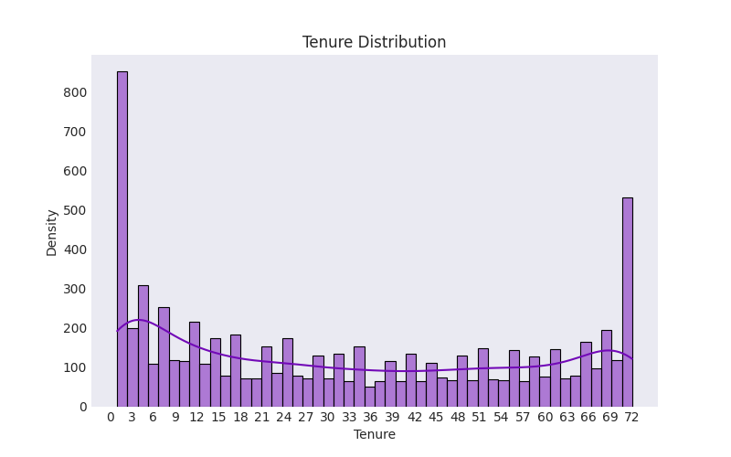

# Análise Exploratória de Dados (EDA) - Telecom Churn

## 1. Introdução
The Telco customer churn data contains information about a fictional telco company that proviUm número expressivoded home phone and Internet services to 7043 customers in California in Q3. It indicates which customers have left, stayed, or signed up for their service. 

---

## 2. Dados Utilizados

---

## 3. Análises Univariadas

### 3.1 - Distribuição do Churn

- Aproximadamente 26.6% dos clientes cancelaram o serviço.
- Aqui apresenta um desbalanceamento na quantidade da amostra de usuários. A quantidade de cancelamentos é bem menor que a quantidade de não cancelamentos.
---

### 3.2 - Distribuição de Tempo de Contrato (Tenure)

Analisando a frenquência dos valores de tempo de contrato, a figura sugere uma distribuição bimodal. Onde os maiores números de tempo de contrato concentram-se nos primeiros e nos ultimos 6 meses, neste recorte de tempo da base dados.

No entanto, observa-se que os clientes com menos tempo de contrato são a maioria. Precisamos investigar se esses clientes também representam um maior número de cancelamentos (Churn) 

De fato! mais de 50% dos clientes que possuem tempo de contrato de 0 a 6 meses, cancelaram o serviço. Isso destaca que um menor tempo de contrato é um elemento importantíssimo para construir um perfil de risco.

---

### 3.3 - Distribuição de Cobrança Total (TotalCharges)

- Distribuição assimétrica, concentrada em clientes com baixas cobranças acumuladas.

Seguimentando o total gasto pelo cliente (Total Charges) em 4 intervalos, observamo que o maior número de cancelamento de serviço se dá na faixa de menor valor de até $1000. O que é perfeitamente compreensível uma vez que clientes com menos tempo de contrato tendem a cancelar o serviço e o montante arrecadado pela empresa deverá ser menor.

---

### 3.4 - Distribuição de Cobrança Mensal (MonthlyCharges)

- Muitos clientes pagam tarifas mensais moderadas, mas existem planos com tarifas mais elevadas.

Apesar dos clientes da faixa de gasto totais até $1000 serem maioria na base de dados analisada, eles possuem as menores médias de tempo de contrato e de pagamento mensal, cerca de 10.1 meses e $48/mês respectivamente. 

Ao contrário dos clientes da faixa $4000+ que possui as maiores médias de tempo de contrato e de pagamento mensal, além aproximadamente 85% dos clientes não cancelaram o serviço.

---

## Grupo 1 - Churn vs (Gender | SeniorCitizen | Partner | Dependents)
### 1.1 - Churn vs Gênero

Há um balancemaneto de amostra de clientes do sexo femino e masculino.
---
### 1.2 - Churn vs Idosos (SeniorCitizen)

Temos um número muito pequeno de clientes idosos cerca de 1142, no entanto, cerca de 41% deles cancelaram o serviço com a empresa, o que é uma porcentagem significativa diante do número total desse público.
---
### 1.3 - Churn vs Parceiros(Partner)

Clientes que possuem parceiros(as) tem menos cancelamentos em comparação com aqueles que vivem ao lado de outra pessoa.
---
### 1.4 - Churn vs Dependentes

Semelhante ao caso dos parceiros, os casos de cancelamento são maiores para aqueles cleintes que não tem dependentes.
---
## Grupo 2 - Churn vs (PhoneService | MultipleLines | InternetService | StreamingTV | StreamingMovies)

### 2.1 - Churn vs Serviço de telefonia (PhoneService)

Um número expressivo de clientes, 90% (6352 clientes), possui serviço de telefonia, porém, a oferta pode abranger tanto telefonia quanto internet.
Destes clientes, 36.5% cancelaram o serviço por algum motivo.
---
### 2.2 - Churn vs Multiplas Linhas (MultipleLines)

Ainda sobre os serviço de telefonia prestado, cerca de  42.2% (2667) dos clientes possuem multiplas linhas disponível em suas residências. Um fato interessante é de se notar, é que ter ou não multiplas linhas possuem um número muito semelhante de cancelamento, o que nos leva a crer que isto não é um fator determinante para o rompimento de contrato pela parte dos usuários.

---
### 2.3 - Churn vs Serviços de internet (InternetService)

Diante dos clientes 3096 que assinam o serviço de internet por fibra ótica, observamos um elevado número de cancelamento neste serviço, cerca de 40% (1297 clientes).
---
### 2.4 - Churn vs Streamings de TV

Serviço de streaming de Tv por assinatura, apresentam proporção equivalente para aqueles que possuem e não possuem o serviço adicional no seu plano, cerca de 30% a 33% de taxa de cancelamento respectivamente
---
### 2.5 - Churn vs Streaming Filmes

Fato semelhante aos que adicionaram serviço de filme no plano, entre 30 a 34% de taxa de cancelamento, respectivamente para aqueles que possuem e não possuem serviço de filmes.
---
## Grupo 3 - OnlineSecurity | OnlineBackup | DeviceProtection | TechSupport |

### 3.1 - Churn vs Serviço de segurança online(OnlineSecurity)

Clientes que não possuem pacote de segurança online, como VPN e Gerenciador de Senhas, tem um considerável número de cancelamento em comparação com os clientes que possuem o serviço.                                             
Oferecer diferentes pacotes  de proteção na web pode ser uma forma de mitigação contra os Churn.
---
### 3.2 - Churn vs Serviço de Backup (OnlineBackup)

Semelhante ao caso anterior, o número de churn mais que dobra (de 523 para 1233 ) nos casos de clientes que não possuem serviço de backup de proteção de dados.
---
### 3.3 - Churn vs Serviço de proteção para dispositivos (DeviceProtection)

Mais uma vez, podemos observar o dobro de casos de cancelamento nos clientes que não possuem proteção adicional em relação aos que possuem em seu pacote de serviços.
---
### 3.4 - Churn vs Suporte Técnico (TechSupport)

Clientes que não possuem suporte técnico adequado temos uma exploão no número de churn, saindo de 310 para 1446, resultando em 366.45% no número de cancelamento do serviço.

---
## 4 - Grupo 4 Churn vs (Contract | PaperlessBilling | PaymentMethod )

## 4.1 - Churn vs. Método de Pagamento

Ainda observando o número de cancelamentos, temos que majoritariamente, os clientes que optam pelo método de pagamento com cheque eletrônico são maioria (57.3%), contrastando com o débito automático no cartão de crédito ( 12.4%)

Os métodos automáticos representam maior fidelização do cliente, e por conseguinte tempo de contrato mais longo, resultando em um menor número de cancelamento e satisfação do serviço.

---
### 4.2 - Churn por Tempo de Contrato

Como visto anteriomente por meio de diferente visões, o  churn é significativamente maior em clientes com pouco tempo de contrato.

---

## 5 - Perfis de risco
Logo será necessario opções de serviços que procurem maior tempo de contrato e benefícios de proteção de dados e segurança online.

